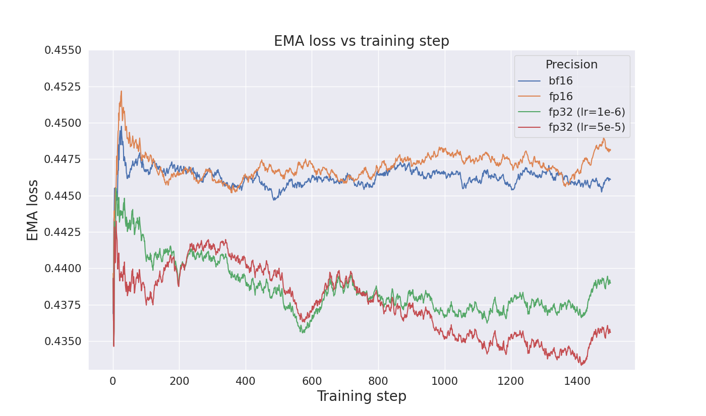

# Diffusion models' PyTorch training benchmark

This repository benchmarks the *training throughput* of contemporary diffusion models on AMD GPU hardware.

The focus is on measuring how quickly different models can be trained (in terms of samples per second), rather than evaluating model quality or inference speed.

## Table of contents

- [Diffusion models' PyTorch training benchmark](#diffusion-models-pytorch-training-benchmark)
  - [Table of contents](#table-of-contents)
  - [Supported models](#supported-models)
  - [Prerequisites](#prerequisites)
  - [Quick setup](#quick-setup)
  - [Detailed environment setup](#detailed-environment-setup)
    - [Configuring environment variables with `.env` file](#configuring-environment-variables-with-env-file)
    - [Building and launching the Docker image](#building-and-launching-the-docker-image)
    - [Launching a prebuilt Docker image](#launching-a-prebuilt-docker-image)
    - [Executing shell inside a Docker container](#executing-shell-inside-a-docker-container)
    - [Downloading the assets](#downloading-the-assets)
  - [Running training benchmarks](#running-training-benchmarks)
    - [Creating a custom Accelerate configuration](#creating-a-custom-accelerate-configuration)
  - [Benchmark results (FLUX.1-dev)](#benchmark-results-flux1-dev)
    - [Reproducing the benchmarks](#reproducing-the-benchmarks)
  - [Training stability and convergence analysis](#training-stability-and-convergence-analysis)
  - [Contributing](#contributing)
    - [Pre-commit hooks](#pre-commit-hooks)
      - [Setup](#setup)
      - [Usage](#usage)
    - [Testing](#testing)
      - [GPU-Dependent tests](#gpu-dependent-tests)

## Supported models

The following models are currently supported:

| Model name           | `train_args` value      | Notes                |
|----------------------|------------------------|----------------------|
| FLUX.1-dev           | flux-dev               | Default              |
| Stable Diffusion XL  | stable-diffusion-xl    |                      |
| Mochi-1              | mochi-1                |                      |
| Hunyuan-Video        | hunyuan-video          |                      |
| Wan2.1-i2v           | wan2_1-i2v             |                      |

## Prerequisites

- Git
- Docker
- GPU(s) with appropriate drivers set up: tested on AMD's 8xMI300X
- Valid [Hugging Face user access token](https://huggingface.co/docs/hub/en/security-tokens)
- (Optional) [Hugging Face CLI documentation](https://huggingface.co/docs/huggingface_hub/main/en/guides/cli)

## Quick setup

1) Build and launch the docker container:

    ```bash
    make build_and_launch_docker
    ```

2) Navigate inside the docker using:

    ```bash
    make exec_docker
    ```

3) Download the necessary assets (optional; speeds up the subsequent launching of the training runs):

    ```bash
    make download_assets
    ```

4) Launch the benchmarking script:

    ```bash
    python launcher.py train_args=<model name>
    ```

where model can be any of the [Supported models](#supported-models).

## Detailed environment setup

### Configuring environment variables with `.env` file

The scripts in this project automatically load values from the `.env` file (git-ignored).
If the `.env` file is not present, they will use `.env.example` as a fallback.
To use the default settings, you can copy `.env.example` to `.env` using:

```bash
cp .env.example .env
```

By default, the `.env` file contains the following settings (edit these as needed):

```bash
VOLUME_MOUNT=~/.cache/huggingface:/workspace/huggingface
CONTAINER_NAME=flux-pytorch
IMAGE_NAME=flux-pytorch
```

### Building and launching the Docker image

To build and launch the Docker container, use the following Makefile target (in the **repository root**):

```bash
make build_and_launch_docker
```

- By default, the Docker launch will create a local directory `~/.cache/huggingface` (Hugging Face's default local cache dir) even if it doesn't previously exist (e.g. if Hugging Face cli is not installed).

- It's possible to dynamically override `.env` defaults when running a make script by explicitly setting them.
  Note that variables *must* come after the target so that `.env` won't overwrite them.
  For example:

  ```bash
  make build_and_launch_docker \
    CONTAINER_NAME=my_container \
    IMAGE_NAME=my_image \
    VOLUME_MOUNT="/my_local_mount/:/my_docker_mount"
  ```

  will build and launch docker image `my_image` as a container named `my_container` with mount `/my_local_mount/:/my_docker_mount`.

### Launching a prebuilt Docker image

Launching a Docker container from a prebuilt image can be done with:

```bash
make launch_docker
```

### Executing shell inside a Docker container

To navigate inside a running Docker container, use the `exec_docker` target:

```bash
make exec_docker
```

This will open a shell inside the container specified by `CONTAINER_NAME` above.

### Downloading the assets

To train the models, the training data and the supported models' pretrained checkpoints, which are here referred to as assets, need to be downloaded.
We provide a make script for convenience:

```bash
make download_assets
```

- **Because of caching (see below) the script only needs to run once!**
- The script downloads the checkpoints and training data of *all* the supported models.
This may take a long time and use a lot of disk space.
- The script can be run either inside a Docker container (preferable) or locally.
Running it locally requires the [Hugging Face CLI](https://huggingface.co/docs/huggingface_hub/main/en/guides/cli) to be installed:
the Docker container already includes this requirement.
- The script will prompt the user to provide a valid Hugging Face user access token, if not already logged in
- By default, the assets are downloaded to `~/.cache/huggingface`; Hugging Face's default local cache dir (HF cache).
- The default `VOLUME_MOUNT` configuration synchronizes the local HF cache with that of the Docker container.
As a result, running `make download_assets` inside Docker saves the assets locally in the same location as described above.
Conversely, any assets downloaded locally are automatically also available in the Docker container.

## Running training benchmarks

The training benchmarking runs can be conveniently started with the `launcher.py` utility, which we refer to as the *launcher*.
See `python launcher.py --help` to view all launcher parameters.

To train the model using the launcher, run the following command:

```bash
python launcher.py --config-name=single_run [OPTIONS]
```

**Some commonly used options:**

- `train_args=<flux-dev, stable-diffusion-xl, mochi-1, hynyuan-video, wan2_1-i2v>`: Selects the model to be benchmarked. Defaults to `flux-dev`.
- `accelerate_config.mixed_precision=<bf16, fp16, no>`: Sets the mixed precision mode.
Choose one of the following options:
  - `bf16`: Use bfloat16 precision.
  - `fp16`: Use float16 precision.
  - `no`: Do not use mixed precision.
- `train_args.train_batch_size=<int>`: Specifies the batch size for training.
Replace `<int>` with the desired integer value.
For example, `train_args.train_batch_size=32`.
- `train_args.num_iterations=<int>`: Sets the number of training steps.
- See `python train.py --help` to view the rest of the training parameters.
They can be provided to the launcher with `+train_args.<parameter>=<value>` (notice the leading plus symbol).

For example, to benchmark Wan2.1 image-to-video model with batch size 1, 50% partial gradient checkpointing, and 416x240 resolution, run:

```bash
python launcher.py --config-name=single_run \
 train_args=wan2_1-i2v \
 train_args.train_batch_size=1 \
 train_args.gradient_checkpointing=0.5 \
 train_args.resolution='"416,240"'
```

**Notice:**

- `--config-name` should be the yaml file in the `config` root folder.
These are entry point files that inherit default values from other files organized into folders referred to as 'config groups' in Hydra.
More details about modifying them can be found [here](https://hydra.cc/docs/0.11/tutorial/config_groups/)

- By default, single runs use the `config/accelerate_config/fsdp_config.yaml` configuration, which utilizes Fully-Sharded Data Parallel (FSDP) training across 8 GPUs and disables `torch.compile()`:
see below how to create a custom Accelerate configuration.

### Creating a custom Accelerate configuration

This project uses Accelerate as the training backend.
Accelerate is a PyTorch library that supports multiple distributed training strategies, including DDP, FSDP, and DeepSpeed.
To create or modify an Accelerate configuration, run:

```bash
accelerate config --config_file config/accelerate_config/accl_config.yaml
```

The custom Accelerate configuration can be used in the launcher by running:

```bash
python launcher.py --config-name=<your_config_file> accelerate_config=accl_config [OPTIONS]
```

**Notice!**

- The launcher strictly expects all Accelerate configurations to be located in `config/accelerate_config/` for them to be usable.

- Accelerate and Hydra use different argument names to refer to configuration files: Accelerate uses `--config_file` whereas Hydra uses `--config-name`

## Benchmark results (FLUX.1-dev)

> Benchmark results are currently provided for FLUX.1-dev, but all models listed above are supported by the benchmarking scripts.
Additional benchmark results for other models will be released in the future.

Below are the results for Fully-Sharded Data Parallel (FSDP) training across 8 GPUs.

| Precision | Single GPU FPS (micro batch size = 1) | Single GPU FPS (optimal micro batch size) |
| --------- | ------------------------------------- | ----------------------------------------- |
| bf16      | 2.03                                  | 4.34 (micro batch size = 10)              |

**Table notes:**

- The frames/samples per second (FPS) are counted for a single GPU: the total throughput is FPS * total number of GPUs.
- Batch sizes (bs) are for a single GPU (micro batch size).

### Reproducing the benchmarks

To reproduce the benchmark results using the launcher run:

```bash
python launcher.py --config-name=flux_benchmark
```

which will automatically sweep the training script through a range of different parameter settings (precisions, batch sizes, etc.)

- The results will by default be stored to `outputs/runs`: one can view them with

  ```bash
  csvlook outputs/runs/sweep_000/runs_summary.csv
  ```

### Training stability and convergence analysis

The *pretrained* FLUX.1-dev model was finetuned using different precision modes on the pseudo camera 10k dataset in order to test training stability and loss convergence.
It is important to note that we started from a pretrained checkpoint, so radical loss convergence was not expected from the outset.

The training was launched using the following command, varying the precision and learning rate as required.

```bash
python launcher.py --config-name=single_run \
  train_args.train_batch_size=16 \
  train_args.num_iterations=1500 \
  +train_args.learning_rate=1e-6 \
  +train_args.lr_scheduler=cosine \
  +train_args.lr_warmup_steps=150
```

Full-precision (FP32, `accelerate_config.mixed_precision=no`) training was performed with both low (`1e-6`) and high (`5e-5`) learning rates, as FP32’s higher numerical precision accommodates larger learning rates without numerical instability.
In both cases, the full-precision models showed clear loss convergence, whereas the mixed precision modes did not exhibit a definitive trend toward convergence or divergence.
The reduced precision in mixed precision training is thought to limit the ability to converge effectively.



The following images are generated by the original model (left) and the FP32 finetuned model (lr=1e-6, right) using prompt "Bright neon sign in a busy city street, 'Open 24 Hours', bold typography, glowing lights" with a guidance scale of 3.5.

| Original Model | FP32 Finetuned Model |
|:-------------:|:--------------------:|
|  |  |

## Contributing

Whether you're fixing bugs, adding new features, or improving documentation,
we appreciate your efforts to make this project better.

### Pre-commit hooks

This project uses pre-commit hooks to enforce code quality standards and maintain consistency.
These hooks automatically run before each commit to check and fix issues related to formatting, linting, and other quality checks.

#### Setup

Install and configure pre-commit:

```bash
# Install pre-commit
pip install pre-commit

# Set up the git hooks
pre-commit install
```

#### Usage

The hooks will run automatically on each commit.
You can also run them manually:

```bash
# Run hooks on all files
pre-commit run --all-files

# Update hooks to latest versions (recommended periodically)
pre-commit autoupdate

# Run advanced linting and security checks (optional)
pre-commit run --hook-stage manual --all-files
```

Our pre-commit configuration includes:

- Code formatting and style enforcement
- File cleanliness checks (whitespace, line endings, file validation)
- Static code analysis and linting
- Security vulnerability scanning (manual hook)
- Automatic test execution

> **Note:** Setting up pre-commit locally helps prevent CI pipeline failures, as these same checks will run when you create a pull request to the main branch.

If pre-commit prevents your commit due to failures:

1. Review the error messages
2. Fix the identified issues (many hooks will automatically fix problems)
3. Add the fixed files and try committing again

### Testing

Before opening a pull request, ensure that all new code is covered by tests.
This is essential for maintaining the project's quality and reliability.
You can run the test suite manually using:

```bash
make run_tests
```

Existing tests are run automatically as part of the pre-commit hooks when you commit changes.

#### GPU-Dependent tests

The project includes integration tests that require a GPU to run.
These conditional tests verify that the pipelines work correctly on GPU hardware.
When you run `make run_tests`, these GPU-dependent tests:

- Run automatically on GPU-enabled machines
- May take several minutes to complete
- Are essential for verifying model functionality

It's highly recommended to run these tests on a GPU-enabled machine before opening a pull request.

If necessary, you can manually skip GPU-dependent tests with:

```bash
export SKIP_GPU_TESTS=1
```

## Need help?

If you encounter any problems, please open an issue on GitHub.
